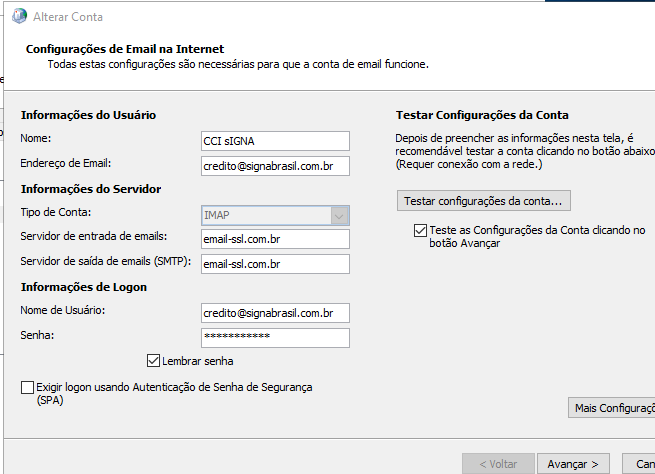
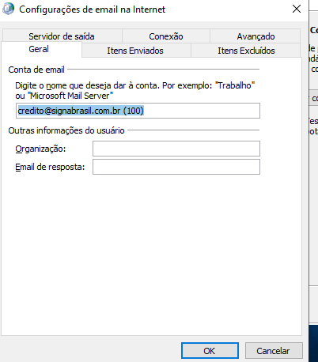
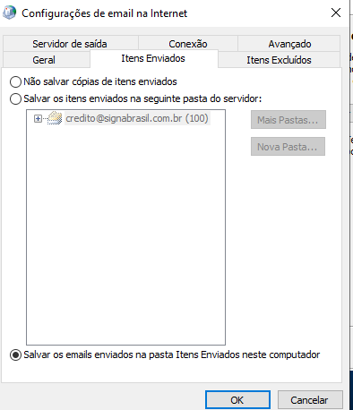
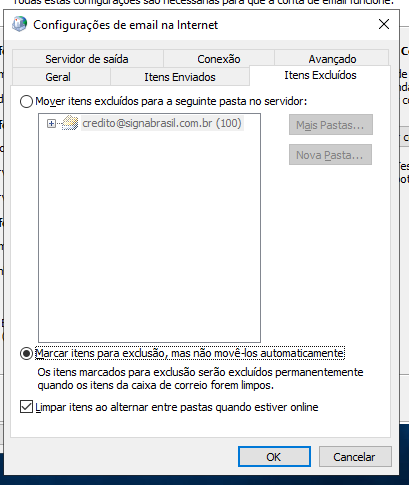
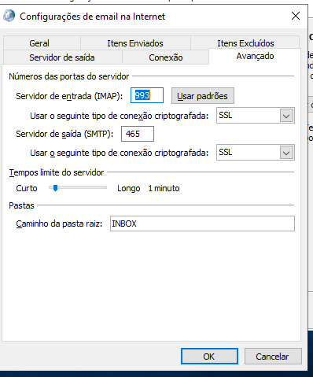
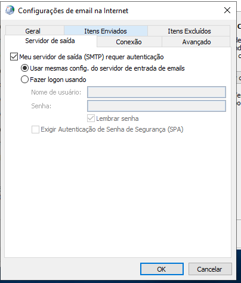

# 1 - Diárias
	
   ##	A - Alimentar o banco de dados (8:00 e 8:30)

      1 - Rodar scraping
         Este comando irá baixar os arquivos para serem atualizados no banco de dados dos seguintes parceiros:
            3R PROMOTORA
            FICASA
            INVEST
            NOVA PROMOTORA
         Serão baixados 2 arquivos de cada um desses parceiros: um `.RET` e outro `.CSV`.

      2 - Formatar os arquivos
         Renomear o arquivo `.RET` para `.TXT`.
         Alterar a codificação do arquivo CSV para UTF-8.

      3 - Importar no bacoffice
         Após as alterações nos arquivos, faça o upload deles no seguinte link: [https://www.signabrasil.com.br/importarbd](https://www.signabrasil.com.br/importarbd).

      4 - Atualizar comissões
         Após o upload, execute o arquivo "Comissões" na área de trabalho do servidor. Ele irá atualizar as comissões no banco de dados com os arquivos que acabaram de serem enviados.

   ##	B - Atulizar Power BI ( 8:30 )
         
      1 Atualizar e publicar power BI

   ##	C - Enviar validações diárias PARÁ ( 9:00 )
         
      1 - Gerar arquivo de comissões no backoffice
         Financeiro > relatório de comissões > seleciona a data > exporta para o excel > Filtrar Maria aparecida e montar na planilha para envio até coluna R.
         
      2 - Enviar por e-mail

   ##	D - Adiantamento e bonus ( 9:30 )
         
      1 - Atualizar arquivos de adiantamento e bonus
         Copy *.csv novoarquivo-win.csv
         Copy *.xlsx novoarquivo-win.xlsx

            67406: 3R PROMOTORA
            69075: FICASA
            12198: INVEST
            13701: NOVA PROMOTORA
            
   ##	E - Comissões diárias ( 10:00)
         
         1 - Montar comissões diárias Para, Amapá e Tocantins.

   ## F - Atualizar Acess e consorcio

      https://www.parceirosbbconsorcios.com.br

      1 - Consócio Geral
         colocar no campo periodo de venda o ultimo dia util. 
      2 - Relatorial Gerecial
         colocar no campo periodo de venda des do inicio do ano
      3 - AcompDoc
         colocar no campo periodo de venda des do inicio de 2018

# 2 - Semanais 

   ## A - Comissões semanais (começar na segunda)
      
      1 - 
      2 - 
      3 -  

# http://192.168.1.102:80/WebServices/Device

C:\Users\Administrador\AppData\Local\Microsoft\Outlook

>E-mail CCI Signa
	user: credito@signabrasil.com.br
	senha: Sgn$prm2k22
	Observação: Outlook

   email-ssl.com.br

   update producao.creditos_bb cb SET VALIDACAO = 'MARLENE DA SILVA DAMASCENA' WHERE operacao 
IN('155371675','155433723','155494714','155552391','155653605','155655265','155667158',
'155813764','155894883','156068235','156111426','156142035','156157856','156162490'
);

select *from producao.creditos_bb cb  where operacao 
IN('155371675','155433723','155494714','155552391','155653605','155655265','155667158',
'155813764','155894883','156068235','156111426','156142035','156157856','156162490'
);

CD C:\Users\Administrador\OneDrive - Signa Brasil\Documentos\apiAutomatizacao\apiAutomatizacao

=SE($Q1="Consulta não realizada por problemas técnicos";1;0)
=$Q$1:$R$100

Sim
=SE($Q1="sim";1;0)
=$1:$100

3100
=SE($G1=3100;1;0)
=$1:$100

BARBARA FERNANDES DA SILVA 
BRUNA MARUCCI BELLUCI
CILANE ALVES DOS SANTOS PAVAO
HELOYSA FERREIRA LIMA
Renata de Carli Samora
SARAH RIBEIRO MARIANO 
Laryssa Izabelli Lázaro Guiguer

SE(E(OU(G44=2880;G44=2881;G44=2882;G44=2891);E(H44<>1640;H44<>137478));"CC";SE(E(G44=2887;E(H44<>1640;H44<>137478));"PT";SE(E(OU(G44=2896;G44=2991;G44=2992;G44=2996;G44=2997);E(H44<>1640;H44<>137478));"NC";SE(E(G44=2097;E(H44<>1640;H44<>137478));"FGTS";SE(E(OU(G44=3100;G44=3101);E(H44<>1640;H44<>137478));"DT";SE(H44=1640;"INSS-CC";SE(H44=137478;"INSS-NC";" ")))))))